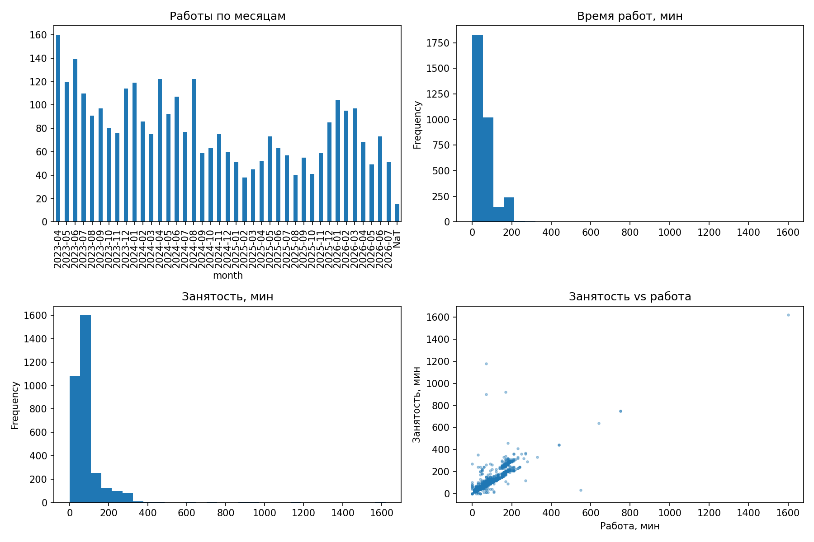
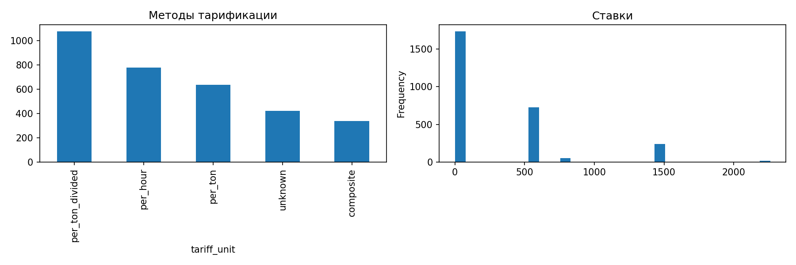
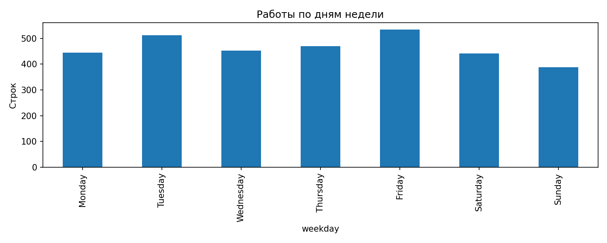

# EDA исторической выгрузки работ буксиров

Источник: `eprojectsdoc_auto_handlingdatahistorical03.04.2023_23.07.2026_extraction.xls`. Скрипт: [`eda_extraction.py`](eda_extraction.py).

## Ограничения данных

**Первое и главное ограничение — разрушенная кодировка.** В исходном HTML вся кириллица уже заменена последовательностями `U+FFFD` (после указанного декодирования видны `пїЅ`). Восстановление текстов невозможно. Поэтому мёртвыми являются поля буксира, типа судна, порта, валюты и вида работ (отдельной колонки вида работ в выгрузке нет). Марковская цепочка видов работ и выводы об агенте/группе по этому файлу невозможны. Скрипт обнаруживает артефакт и не пытается восстанавливать кириллицу.

Правила LOA из ODT: 80–120 → 1 буксир; 120–145 → 2; 146–160 → 2; 161–175 → 3; >175 → 3. В данной выгрузке LOA нет, поэтому правило приведено для совместного использования с будущими данными, а не проверено на этих строках.

## 1. Обзор

| Метрика | Значение |
|---|---:|
| Строк данных | 3,255 |
| Период по началу работ | 03.04.2023—22.07.2026 |
| Уникальных судов (латиница сохранена) | 429 |
| Уникальных номеров ваучеров | 597 |
| Кириллический артефакт найден | да |

Годы:

| | Работ |
|---|---:|
| 2023.0 | 987 |
| 2024.0 | 1057 |
| 2025.0 | 659 |
| 2026.0 | 537 |

Месяцы:

| | Работ |
|---|---:|
| 2023-04 | 160 |
| 2023-05 | 120 |
| 2023-06 | 139 |
| 2023-07 | 110 |
| 2023-08 | 91 |
| 2023-09 | 97 |
| 2023-10 | 80 |
| 2023-11 | 76 |
| 2023-12 | 114 |
| 2024-01 | 119 |
| 2024-02 | 86 |
| 2024-03 | 75 |
| 2024-04 | 122 |
| 2024-05 | 92 |
| 2024-06 | 107 |
| 2024-07 | 77 |
| 2024-08 | 122 |
| 2024-09 | 59 |
| 2024-10 | 63 |
| 2024-11 | 75 |
| 2024-12 | 60 |
| 2025-01 | 51 |
| 2025-02 | 38 |
| 2025-03 | 45 |
| 2025-04 | 52 |
| 2025-05 | 73 |
| 2025-06 | 63 |
| 2025-07 | 57 |
| 2025-08 | 40 |
| 2025-09 | 55 |
| 2025-10 | 41 |
| 2025-11 | 59 |
| 2025-12 | 85 |
| 2026-01 | 104 |
| 2026-02 | 95 |
| 2026-03 | 97 |
| 2026-04 | 68 |
| 2026-05 | 49 |
| 2026-06 | 73 |
| 2026-07 | 51 |
| NaT | 15 |



## 2. Качество и восстановленные поля

Суффикс ваучера восстановил буксир: Пионер — **1,556**, Коммунар — **1,525**, без `p/k` — **174 (5.3%)**. Это строки, требующие отдельной проверки.

Битых значений дат (по четырём datetime-полям) — **61**. Измерения длительностей распознаны как `HH:MM`; пропуски времени работ — **1**, занятости — **1**.

Валюта восстановлена из примечания: | | Строк |
|---|---:|
| USD | 2958 |
| unknown | 297 |.

## 3. Баланс буксиров и парные ваучеры

| | Строк |
|---|---:|
| Пионер | 1556 |
| Коммунар | 1525 |
| без суффикса | 174 |

По ключу судно + совпадающие начало/завершение работ найдено **620** групп с обоими суффиксами `p` и `k` (интерпретация: одна работа на два буксира и два ваучера). Это эвристика, так как исходный идентификатор работы отсутствует.

## 4. Длительности

| Показатель | Время работ, мин | Время занятости, мин |
|---|---:|---:|
| Медиана | 50.0 | 70.0 |
| Q1 | 30.0 | 50.0 |
| Q3 | 70.0 | 90.0 |
| Среднее | 62.3 | 85.4 |
| 95% CI среднего | [60.3, 64.3] | [82.8, 87.9] |

Корреляция Пирсона между занятостью и временем работ: **0.861**.


## 5. Тарификация и GRT

| | Строк |
|---|---:|
| per_ton_divided | 1078 |
| per_hour | 780 |
| per_ton | 638 |
| unknown | 422 |
| composite | 337 |

Доля основных классов: per_ton с делителем — **33.1%**, per_ton — **19.6%**, per_hour — **24.0%**, composite — **10.4%**. Медианная ставка для per_ton: **0.50**, для per_hour: **600.00**. Наиболее частый делитель: **3.0**.

GRT: медиана **19549 t**, Q1–Q3 **3618–23456 t**, диапазон **118–118423 t**.



## 6. Проверка формул

Для распознанных примечаний `amount` пересчитан из последнего выражения после `=`. Доля расхождений более 0.02 валютных единицы: **10.3%**, медианная абсолютная разница: **0.0000**. Для выручки `сумма × курс` проверено 3,250 строк; расхождений более 1 рубля — **0 (0.0%)**.

## 7. Валюта и курс

| | Строк |
|---|---:|
| USD | 2958 |
| unknown | 297 |

Курс: медиана **84.9471**, диапазон **1.0000–108.0104**. По времени медианный курс меняется вместе с датой выгрузки; для детального временного ряда используйте `frame` в скрипте.

## 8. Ночь и выходные

Работы, начавшиеся ночью (22:00–06:00): **598 (18.4%)**. Выходные (суббота/воскресенье): **829 (25.5%)**.



## 9. Лаг заявки до работы

Дата из имени заявки извлечена в **3,030** строках. Медианный лаг — **0.0 дня**, Q1–Q3 — **0.0–1.0**, диапазон — **0–365** дней. Год в имени заявки не указан: для каждой строки выбрана наиболее поздняя дата с этим месяцем/днём, не превышающая дату работы; результат около годовых границ следует трактовать осторожно.

## 10. Номера ваучеров

Диапазон числовых номеров: **1–597**. Пропусков номера — **6**. Номеров, повторяющихся в нескольких строках/суффиксах, — **560**; наиболее полезная интерпретация повторов — пары буксиров на одной операции, но это проверяется эвристикой из раздела 3.

## 11. Дополнительные артефакты и воспроизводимость

Сохранены три PNG в `analysis/figures/`. Запуск:

```bash
python analysis/eda_extraction.py path/to/export.xls
```

Скрипт принимает путь к HTML-таблице с расширением `.xls`, декодирует `cp1251`, извлекает 23 колонки, восстанавливает буксир/валюту/метод тарификации и заново создаёт этот отчёт и рисунки. Зависимости вынесены в `analysis/requirements-eda.txt`.
