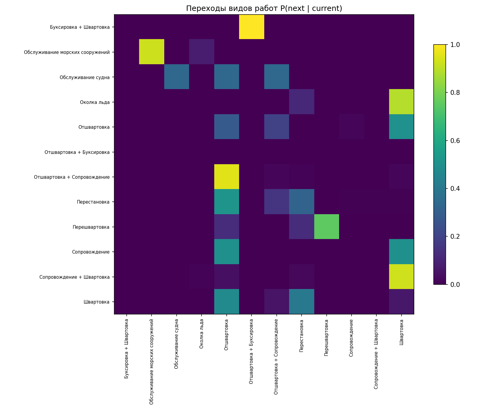

# EDA исторической выгрузки работ буксиров

Источник: `extraction_clean.xls` (HTML-таблица windows-1251, читается через BeautifulSoup — не `read_excel`). Скрипт: [`eda_extraction.py`](eda_extraction.py).

## Замечание о кодировке
Первая присланная копия файла была повреждена при передаче: кириллица была затёрта символом `U+FFFD`. Эта версия (из `.rar`) **целая** — кириллица на месте, поэтому доступны поля «Вид работ» и «Агент», и построены цепочка работ и тарифные группы. LOA/осадки в выгрузке нет (только в заявках) — правило «LOA → буксиры» из ODT остаётся для будущих данных.

## 1. Обзор

| Метрика | Значение |
|---|---:|
| Строк данных | 3,255 |
| Период (начало работ) | 03.04.2023—22.07.2026 |
| Уникальных судов | 435 |
| Уникальных номеров ваучеров | 597 |
| Видов работ | 14 |
| Агентов | 16 |


## 2. Вид работ

| | Работ |
|---|---:|
| Швартовка | 1064 |
| Отшвартовка | 1001 |
| Перестановка | 814 |
| Отшвартовка + Сопровождение | 149 |
| Сопровождение + Швартовка | 98 |
| Перешвартовка | 50 |
| Обслуживание морских сооружений | 44 |
| Околка льда | 12 |
| Сопровождение | 10 |
| Обслуживание судна | 7 |
| Буксировка | 2 |
| Проводка каравана | 1 |
| Буксировка + Швартовка | 1 |
| Отшвартовка + Буксировка | 1 |
| (пусто) | 1 |

## 3. Агенты и тарифные группы

Группа A = Транс-Агро; B = {Терминал, Содружество - Соя}; C = остальные.

| | Строк |
|---|---:|
| A | 2915 |
| C | 278 |
| B | 54 |
| unknown | 8 |

Доля Транс-Агро (A): **89.6%** — согласуется с оценкой ~90%.

| | Строк |
|---|---:|
| Транс-Агро | 2915 |
| Светловский судоремонтный завод | 103 |
| ТБК | 80 |
| Терминал | 35 |
| Мазут Опт Сервис | 32 |
| МореСервис | 29 |
| Содружество - Соя | 19 |
| Альфа Марин Транспорт | 9 |
| РТА | 8 |
| БалтРегион плюс | 7 |
| - | 7 |
| МА Шельф-Флот | 4 |
| За Родину-Балтика | 3 |
| ПОСЕЙДОН | 1 |
| ООО Пеламис | 1 |
| ТрансМарин Порт Сервис | 1 |
| (пусто) | 1 |

## 4. Метод тарификации × группа

| группа | composite | per_hour | per_ton | per_ton_divided | unknown |
|---|---|---|---|---|---|
| A | 335 | 736 | 637 | 1076 | 131 |
| B | 0 | 44 | 0 | 0 | 10 |
| C | 6 | 100 | 1 | 2 | 169 |
| unknown | 0 | 6 | 0 | 0 | 2 |

Медианные ставки: per_ton **0.50**, per_hour **600.00**. Самый частый делитель: **3.0**.


## 5. Цепочка видов работ (матрица переходов)

P(следующий вид | текущий) внутри судозахода (разрыв > 7 дн. считается новым заходом), суда упорядочены по времени. Значения — доли по строке.

| из \ в | Буксировка + Швартовка | Обслуживание морских сооружений | Обслуживание судна | Околка льда | Отшвартовка | Отшвартовка + Буксировка | Отшвартовка + Сопровождение | Перестановка | Перешвартовка | Сопровождение | Сопровождение + Швартовка | Швартовка |
|---|---|---|---|---|---|---|---|---|---|---|---|---|
| Буксировка + Швартовка | 0.00 | 0.00 | 0.00 | 0.00 | 0.00 | 1.00 | 0.00 | 0.00 | 0.00 | 0.00 | 0.00 | 0.00 |
| Обслуживание морских сооружений | 0.00 | 0.92 | 0.00 | 0.08 | 0.00 | 0.00 | 0.00 | 0.00 | 0.00 | 0.00 | 0.00 | 0.00 |
| Обслуживание судна | 0.00 | 0.00 | 0.33 | 0.00 | 0.33 | 0.00 | 0.33 | 0.00 | 0.00 | 0.00 | 0.00 | 0.00 |
| Околка льда | 0.00 | 0.00 | 0.00 | 0.00 | 0.00 | 0.00 | 0.00 | 0.11 | 0.00 | 0.00 | 0.00 | 0.89 |
| Отшвартовка | 0.00 | 0.00 | 0.00 | 0.00 | 0.28 | 0.00 | 0.19 | 0.00 | 0.00 | 0.02 | 0.00 | 0.50 |
| Отшвартовка + Буксировка | nan | nan | nan | nan | nan | nan | nan | nan | nan | nan | nan | nan |
| Отшвартовка + Сопровождение | 0.00 | 0.00 | 0.00 | 0.00 | 0.95 | 0.00 | 0.02 | 0.01 | 0.00 | 0.00 | 0.00 | 0.02 |
| Перестановка | 0.00 | 0.00 | 0.00 | 0.00 | 0.52 | 0.00 | 0.15 | 0.32 | 0.00 | 0.00 | 0.00 | 0.00 |
| Перешвартовка | 0.00 | 0.00 | 0.00 | 0.00 | 0.12 | 0.00 | 0.00 | 0.12 | 0.75 | 0.00 | 0.00 | 0.00 |
| Сопровождение | 0.00 | 0.00 | 0.00 | 0.00 | 0.50 | 0.00 | 0.00 | 0.00 | 0.00 | 0.00 | 0.00 | 0.50 |
| Сопровождение + Швартовка | 0.00 | 0.00 | 0.00 | 0.01 | 0.04 | 0.00 | 0.00 | 0.02 | 0.00 | 0.00 | 0.00 | 0.93 |
| Швартовка | 0.00 | 0.00 | 0.00 | 0.00 | 0.48 | 0.00 | 0.05 | 0.40 | 0.00 | 0.00 | 0.00 | 0.06 |



## 6. Длительности

| Показатель | Время работ, мин | Занятость, мин |
|---|---:|---:|
| Медиана | 50.0 | 70.0 |
| Q1 | 30.0 | 50.0 |
| Q3 | 70.0 | 90.0 |
| 95% CI среднего | [60.3, 64.3] | [82.8, 87.9] |

Корреляция занятости и времени работ: **0.861**.

Медиана времени работ по виду (мин, приор для предсказания времени):

| | Медиана, мин |
|---|---:|
| Буксировка + Швартовка | 440 |
| Отшвартовка + Буксировка | 440 |
| Буксировка | 210 |
| Отшвартовка + Сопровождение | 170 |
| Сопровождение + Швартовка | 170 |
| Сопровождение | 90 |
| Перешвартовка | 80 |
| Проводка каравана | 70 |
| Обслуживание судна | 70 |
| Перестановка | 60 |
| Швартовка | 50 |
| Обслуживание морских сооружений | 45 |
| Отшвартовка | 30 |
| Околка льда | 30 |

## 7. Буксиры и парные операции

| | Строк |
|---|---:|
| БК Коммунар | 1591 |
| БК Пионер | 1565 |
| - | 80 |
| МБ Лигер | 17 |
| Test | 1 |
| (пусто) | 1 |

Операций с обоими буксирами (одно судно + совпадающие начало/конец): **642**. Совпадение колонки «Буксир» и суффикса файла p/k: **3043** из **3073** (99.0%).

## 8. GRT, валюта, курс

GRT: медиана **19549 t**, Q1–Q3 **3618–23456 t**, диапазон **118–118423 t**.

| | Строк |
|---|---:|
| USD | 2974 |
| RUB | 280 |
| unknown | 1 |

Курс: медиана **84.9471**, диапазон **1.0000–108.0104**.

## 9. Ночь, выходные, лаг заявки, формулы

- Ночные работы (22:00–06:00): **598 (18.4%)**.
- Выходные: **829 (25.5%)**.
- Лаг заявка→работа: медиана **0.0** дн., Q1–Q3 **0.0–1.0** (извлечено 3,030 дат из имени заявки).
- Пересчёт amount из примечания: расхождений >0.02 — **12.2%**.
- Проверка `сумма×курс→выручка`: расхождений >1 руб — **0** из 3,250.

## 10. Запуск

```bash
python analysis/eda_extraction.py path/to/export.xls
```

Зависимости — в `analysis/requirements-eda.txt`.
