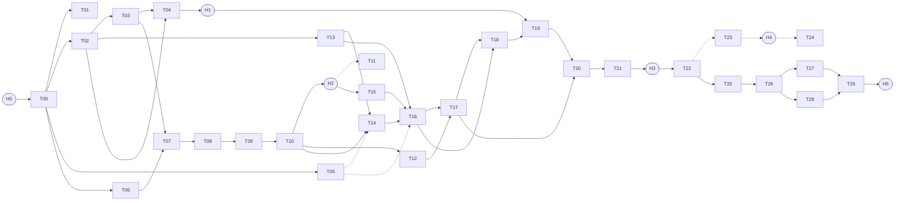

# Рукописные даты, время и номер ваучера: план из атомарных задач

Дата: 2026-09-29.
Основа:
- `docs/ocr_dates_plan.md` — метод;
- `ocr_dates_guide.md`, `docs/class_vs_ocr.md`, `docs/base_logic.md`;
- справочник моделей Claude Code CLI и Devin CLI — выбор моделей.

## Коротко

- **30 задач `T00`–`T29` и шаблон ревью `R`.** Одна задача — одна неинтерактивная сессия
  `claude -p` или `devin -p`. 26 задач обязательны. Опциональны 4: `T05` (GPU),
  `T11` (запасное выравнивание, условная), `T23` и `T24` (почерк, эксперимент).
- **Шесть ручных точек `H0`–`H5`.** Человек подтверждает поправки истины, смотрит листы
  кропов, выбирает политику автоприёма и принимает результат. Всё остальное работает
  без него.
- **У каждого промпта шапка с признаками по справочнику моделей:** `type`, `complexity`,
  `risk`, `size`, `needs_vision`; модель и effort для Claude Code; модель Devin; канал;
  ревьюер. Раннер `run_task.py` читает шапку, проверяет зависимости и запускает сессию.
- **Преемственность между сессиями** держится на трёх файлах:
  - `CONTEXT.md` — факты о машине и данных;
  - `PROGRESS.md` — журнал задач;
  - `DECISIONS.md` — ответы человека.
- **Облачная альтернатива** — [cloud_alternative.md](cloud_alternative.md).

## Как запускать

### Подготовка (ручная точка H0)

1. Обновить Claude Code: `claude update`. Для Opus 5.5 нужна версия **≥ 2.1.280**, а на ПК,
   по справочнику, стоит 2.1.272.
2. Забрать этот каталог в локальный клон и начать рабочую ветку:
   ```bash
   git fetch origin claude/brave-ramanujan-4vyvlw
   git switch -c ocr/handwritten-dates
   git merge origin/claude/brave-ramanujan-4vyvlw
   ```
3. Ответить на вопросы Q1–Q8 в [DECISIONS.md](DECISIONS.md) и отметить `[x] H0`.
   Особенно важен Q5: можно ли показывать модели картинки сканов при разработке.
4. На время работы очереди не держать открытыми длинные интерактивные сессии. После
   часовой паузы такая сессия заново пишет кэш и съедает 16–20 % окна (справочник, § 16.5).

### Запуск задачи

```bash
python docs/ocr_tasks/run_task.py --status        # что готово, что можно запускать
python docs/ocr_tasks/run_task.py T00 --dry-run   # показать команду и проверки
python docs/ocr_tasks/run_task.py T00             # запустить
```

Что делает раннер:
- **Перед запуском проверяет:**
  - ветку (не `main`);
  - что в отслеживаемых файлах нет незакоммиченных правок;
  - зависимости: раздел задачи в `PROGRESS.md` со строкой `- Статус: готово`,
    ручные точки `[x] Hn` в `DECISIONS.md`;
  - версию CLI для Opus 5.5.
- **Запрещает** Fable без `--allow-credits`.
- **Отдаёт сессии** короткое ASCII-задание «прочитай `_common.md` и файл задачи».
  Так нет проблем с кодировкой в Windows.
- **Процесс сессии:**
  - убирает `ANTHROPIC_API_KEY` из окружения, чтобы не уйти из подписки в оплату по API
    (D-28);
  - выставляет `PYTHONUTF8=1`;
  - запрещает `git push`, `reset --hard`, `clean`, `rebase`, `switch` и `rm -rf`.
- **Пишет лог** `stream-json` в `data/ocr/logs/` и печатает ход работы. В конце — сводка:
  ходы, время, $ по прайсу, модели в сессии (видна подмена модели классификатором),
  заполненность окна и недели из `rate_limit_event`.

Полезные ключи:

| Ключ | Что делает |
|---|---|
| `--channel devin` / `--channel claude` | Сменить канал, например задачу `claude_first` отдать в Devin, когда окно Claude занято |
| `--effort xhigh`, `--model <полный ID>` | Ручная эскалация |
| `--review` | Ревью по `prompts/R_review.md` ревьюером из шапки (другой вендор) |
| `--fix` | Повтор после ревью «❌» на ступень выше: сначала effort, потом модель (справочник, § 8.3) |
| `OCR_MODEL_MAP="claude-sonnet-5=claude-sonnet-5-5"` | Подменить модель во всех задачах без правки шапок |
| `--budget auto` | Потолок `--max-budget-usd` по размеру блока (S 3, M 5, L 8). На подписке сначала проверить |
| `--export-json` | Шапки всех задач в JSON — для своего раннера очереди с `model-routing.json` |
| `--cloud-prompt` | Текст задания для облачной сессии (см. `cloud_alternative.md`) |

### Очередь: все задачи подряд

```bash
python docs/ocr_tasks/run_task.py --all --dry-run   # что запустится сейчас и чего ждёт остальное
python docs/ocr_tasks/run_task.py --all             # выполнять по одной, пока есть доступные
```

Задачи идут **строго последовательно**: все пишут в одну ветку и один `PROGRESS.md`,
`git switch` им запрещён, GPU один. Параллельный запуск дал бы гонки в git. После каждой
задачи раннер перечитывает `PROGRESS.md` и берёт следующую, чьи зависимости выполнены.
Очередь останавливается:
- на ручных точках H1–H5 (отметьте `[x]` в `DECISIONS.md` и запустите `--all` снова);
- на первой задаче, завершившейся с ошибкой или без записи в `PROGRESS.md`;
- если задача оставила незакоммиченные правки отслеживаемых файлов.

Задача со статусом «частично» повторно в том же прогоне не запускается, а её
зависимые ждут. Опциональные T05, T11, T23, T24 берутся только с `--with-optional`;
облачные C1, C2 и шаблон R — никогда. `--max-tasks N` ограничивает число задач за прогон.
Ревью (`--review`, `--fix`) очередью не запускается.

Защита от сбоев (во всех режимах, `--all` тоже):
- **Сторож.** Нет ни одной строки вывода дольше `--idle-timeout` минут (по умолчанию 40,
  `0` — выключить) — сессия убивается вместе с потомками, код выхода 124, очередь
  останавливается. Если процесс завершился, а канал вывода держит потомок, раннер
  ждёт не дольше 5 секунд.
- **Повтор при временных ошибках API.** Сессия, которая завершилась с `authentication_failed`
  (403) или «API Error» с кодом 408, 409, 425, 429, 500, 502, 503, 504, 529 либо с текстом про
  таймаут, перегрузку и обрыв соединения, перезапускается до `--api-retries` раз (по умолчанию 3;
  старое имя `--auth-retries` работает) с паузой `--api-retry-delay` секунд (120, дальше
  удваивается, не больше 30 минут). Сам `claude` к этому моменту уже повторил запрос до 10 раз.
  Ошибки запроса (400, 404, 413), «Not logged in» и `error_max_turns` не повторяются: перезапуск
  их не исправит. Повтор продолжает с готовых файлов; лог — `…_retryN.jsonl`.
- **Поиск `claude`.** Среди `PATH`, `%APPDATA%\Claude\claude-code\…` и `~/.local/bin`
  берётся самая свежая версия по `--version`. Свой путь: переменная `OCR_CLAUDE_BIN`.

### После каждой задачи

1. Просмотреть `git log -1 --stat`, раздел задачи в `PROGRESS.md` и «Вопросы к человеку».
2. Ответы на вопросы переносить в `DECISIONS.md`.
3. Ревью:
   - обязательно для задач с логикой, от которой зависит всё дальше: T02, T06, T13, T16,
     T19, T20, T26;
   - для остальных — выборочно, по справочнику, § 8.4;
   - при вердикте ❌ — `run_task.py <T> --fix`.

## Задачи

«Размер» — класс блока для оценки расхода окна Claude: S ≈ 7 %, M ≈ 12 %, L ≈ 18 %
пятичасового окна Pro на Sonnet 5 (справочник, § 0.2).

### Этап 0. Истина и окружение

| № | Задача | После | Тип · размер | Claude Code | Devin | Канал | Ревью |
|---|---|---|---|---|---|---|---|
| T00 | [Инвентаризация → CONTEXT.md](prompts/T00_inventory.md) | H0 | research · S | Sonnet 5 `high` | Sonnet 5 Medium | Claude → Devin | — |
| T01 | [Кириллица в именах файлов](prompts/T01_voucher_number_cyrillic.md) | T00 | refactor-local · S | (Sonnet 5 `medium`) | **SWE-2 Medium** | Devin | Sonnet 5 `medium` |
| T02 | [Манифест, поправки истины, сплит](prompts/T02_manifest.md) | T00 | business-rules · M | Sonnet 5 `high` | Sonnet 5 Medium | Claude → Devin | GPT-5.6 Sol High |
| T03 | [Загрузка сканов, кэш страниц](prompts/T03_scan_loading.md) | T02 | api-contract · M | Sonnet 5 `medium` | SWE-2 High | Claude → Devin | GPT-5.6 Sol High |
| T04 | [Визуальная сверка истины](prompts/T04_truth_visual_check.md) | T02, T03 | research, vision · M | Opus 5.5 `high` | — | только Claude | человек (**H1**) |
| T05 | [GPU-окружение (опц.)](prompts/T05_gpu_env.md) | T00 | infra · M | Sonnet 5 `high` | Sonnet 5 Medium | Claude → Devin | — |

### Этап 1. Геометрия (рычаг №1)

| № | Задача | После | Тип · размер | Claude Code | Devin | Канал | Ревью |
|---|---|---|---|---|---|---|---|
| T06 | [Модуль выравнивания (синтетика)](prompts/T06_alignment_module.md) | T00 | algo · L | Opus 5.5 `high` | Opus 5 Medium | Claude → Devin | GPT-5.6 Sol High |
| T07 | [Варианты бланка, эталоны, пороги](prompts/T07_layout_variants.md) | T03, T06 | algo, vision · L | Opus 5.5 `high` | — | только Claude | человек |
| T08 | [Боксы подполей: Коммунар](prompts/T08_boxes_kommunar.md) | T07 | algo, vision · L | Opus 5.5 `high` | — | только Claude | человек |
| T09 | [Боксы подполей: Пионер и прочие](prompts/T09_boxes_pioneer.md) | T08 | algo, vision · L | Opus 5.5 `high` | — | только Claude | человек |
| T10 | [Нарезка кропов + контроль 98 %](prompts/T10_crops_qc.md) | T09 | algo, vision · L | Opus 5.5 `medium` | — | только Claude | человек (**H2**) |
| T11 | [Запасное выравнивание (условная)](prompts/T11_alignment_fallback.md) | T10, H2 | algo, vision · L | Opus 5.5 `high` | — | только Claude | человек |
| T12 | [Печатное / рукописное](prompts/T12_printed_vs_handwritten.md) | T10 | research, vision · M | Sonnet 5 `medium` | — | только Claude | человек |

### Этап 2. Базовая модель

| № | Задача | После | Тип · размер | Claude Code | Devin | Канал | Ревью |
|---|---|---|---|---|---|---|---|
| T13 | [Формат предсказаний и метрики](prompts/T13_metrics.md) | T02 | business-rules · M | Sonnet 5 `high` | Sonnet 5 Medium | Claude → Devin | GPT-5.6 Sol High |
| T14 | [Бейзлайн TrOCR на новых кропах](prompts/T14_trocr_baseline.md) | T10, T13 | research · S | Sonnet 5 `medium` | SWE-2 High | Claude → Devin | — |
| T15 | [Датасет и аугментации](prompts/T15_dataset_augment.md) | T10, H2 | algo · M | Sonnet 5 `high` | Sonnet 5 Medium | Claude → Devin | GPT-5.6 Sol High |
| T16 | [CNN: день, месяц, часы, минуты](prompts/T16_train_digits.md) | T13, T14, T15 | algo · L | Opus 5.5 `high` | Opus 5 Medium | Claude → Devin | GPT-5.6 Sol High |
| T17 | [Модель номера ваучера](prompts/T17_number_model.md) | T12, T16 | algo · L | Opus 5.5 `high` | Opus 5 Medium | Claude → Devin | GPT-5.6 Sol High |
| T18 | [Калибровка и ONNX](prompts/T18_calibration_onnx.md) | T16, T17 | api-contract · M | Sonnet 5 `high` | Sonnet 5 Medium | Claude → Devin | GPT-5.6 Sol High |

### Этап 3. Совместный декодер (рычаг №2)

| № | Задача | После | Тип · размер | Claude Code | Devin | Канал | Ревью |
|---|---|---|---|---|---|---|---|
| T19 | [Декодер: ядро](prompts/T19_decoder_core.md) | T18, H1 | algo · L | **Opus 5.5 `xhigh`** | Opus 5 High | Claude → Devin | **GPT-6 Astra High** |
| T20 | [Декодер: номер + пары k/p](prompts/T20_decoder_number_pairs.md) | T17, T19 | algo · L | Opus 5.5 `high` | Opus 5 Medium | Claude → Devin | GPT-5.6 Sol High |
| T21 | [Сквозная оценка, порог автоприёма](prompts/T21_e2e_eval_threshold.md) | T20 | acceptance · L | Opus 5.5 `high` | Opus 5 High | Claude → Devin | человек (**H3**) |
| T22 | [Поправки истины → v1](prompts/T22_truth_fix_retrain.md) | T21, H3 | tests · M | Sonnet 5 `medium` | Sonnet 5 Medium | Claude → Devin | — |

### Этап 4. Почерк (эксперимент, после цифр этапов 0–3)

| № | Задача | После | Тип · размер | Claude Code | Devin | Канал | Ревью |
|---|---|---|---|---|---|---|---|
| T23 | [Слоты вахт и почерк](prompts/T23_writer_slots.md) | T22 | research · L | Opus 5.5 `high` | Opus 5 Medium | Claude → Devin | человек (**H4**) |
| T24 | [Адаптация к автору](prompts/T24_writer_adaptation.md) | T23, H4 | algo · L | Opus 5.5 `high` | Opus 5 Medium | Claude → Devin | GPT-5.6 Sol High |

### Этапы 5–6. Встраивание и цикл

| № | Задача | После | Тип · размер | Claude Code | Devin | Канал | Ревью |
|---|---|---|---|---|---|---|---|
| T25 | [Рантайм-пайплайн `app/ocr/pipeline.py`](prompts/T25_runtime_pipeline.md) | T22 | api-contract · M | Sonnet 5 `high` | Sonnet 5 Medium | Claude → Devin | GPT-5.6 Sol High |
| T26 | [Интеграция в приложение и БД](prompts/T26_app_integration.md) | T25 | db-migration · M | Sonnet 5 `high` | Sonnet 5 Medium | Claude → Devin | GPT-5.6 Sol High |
| T27 | [UI проверки: top-3, кропы](prompts/T27_review_ui.md) | T26 | new-screen · M | Sonnet 5 `high` | Sonnet 5 Medium | Claude → Devin | GPT-5.3-Codex High |
| T28 | [Цикл дообучения, мониторинг](prompts/T28_retrain_loop.md) | T26 | business-rules · M | Sonnet 5 `high` | Sonnet 5 Medium | Claude → Devin | GPT-5.6 Sol High |
| T29 | [Приёмка end-to-end (Windows)](prompts/T29_acceptance.md) | T27, T28 | acceptance · L | Opus 5.5 `high` | Opus 5 High | Claude → Devin | человек (**H5**) |

## Граф зависимостей



Критический путь:
T00 → T02 → T03 → T07 → T08 → T09 → T10 → H2 → T15 → T16 → T17 → T18 → T19 → T20 →
T21 → H3 → T22 → T25 → T26 → T27 → T29.

T01, T05, T06, T13 и T04 можно вставлять в очередь раньше, как только выполнены их
зависимости.

## Ручные точки

| Точка | Когда | Что сделать | Время |
|---|---|---|---|
| H0 | до старта | `claude update`, ветка, ответы Q1–Q8 в `DECISIONS.md` | 15 мин |
| H1 | после T04 | Посмотреть `mismatch` и `unclear` сверки истины. Проставить `confirmed` или `rejected` в `data/ocr/truth_corrections.csv`. Ответить Q1 и Q2 | 20–40 мин |
| H2 | после T10 | Пролистать листы кропов `data/ocr/sheets/`: критерий 98 % выполнен? Нужна ли T11? | 10 мин |
| H3 | после T21 | Разобрать «уверенные расхождения» (до 50). Проставить статусы поправок. Утвердить Q3 (автоприём) и Q4 (целевая точность) | 30–60 мин |
| H4 | после T23 (опц.) | Лист на кластер почерка: похоже ли на отдельных людей? Нужна ли T24? | 15 мин |
| H5 | после T29 | Решение по `ACCEPTANCE.md` | 30 мин |

## Почему такие модели

Правила взяты из справочника моделей (§ 0.3, § 1.2, § 8, § 14):

- **Opus 5.5 `high`** — алгоритмы, ML, CV, приёмка (`type: algo`, `acceptance`,
  `complexity: high`). По замерам справочника Opus в лимите подписки Pro не дороже Sonnet
  (Opus 5 ≈ 0,8 от Sonnet 5, Opus 5.5 оценочно ≈ 0,65). Работу уровня Opus выгодно вести
  в Claude Code.
- **Opus 5.5 `xhigh`** — только T19 (ядро декодера). Это самая трудная и самая дорогая
  по последствиям часть: полночь, смена месяца, 24:00, калибровка весов. Ошибки там тихо
  снижают точность всего остального.
- **Sonnet 5 `high` / `medium`** — бизнес-правила, контракты, миграция БД, UI, обвязка
  (`type: business-rules`, `api-contract`, `db-migration`, `new-screen`, `infra`).
  `medium` — там, где задача хорошо поставлена и закрыта тестами.
- **Devin SWE-2** (бесплатно) — рутинная T01. В Claude её стоит запускать только при
  «доедании недели».
- **Отклонение от правила 11 справочника** («картинки → Sonnet 5 `high`»). Задачи, где
  по картинкам нужно точно читать рукопись или ставить боксы с точностью до пикселей
  (T04, T07–T11), отданы Opus 5.5 `high`. Цена ошибки там выше, а в лимите Pro Opus
  не дороже. Лёгкая классификация «печать или рукопись» (T12) осталась на Sonnet 5.
- **Ревью.** Ревьюер — другой вендор (§ 8.4). Ради бюджета Devin работу Opus смотрит
  GPT-5.6 Sol High (≈ $1,34 за задачу по каталогу), а не GPT-6 Astra High (≈ $11).
  Исключение — T19.
- **Fable 5.1 не используется.** На Pro он оплачивается только кредитами, и `claude -p`
  списывает их без вопроса (§ 1.3, п. 4). Раннер блокирует его без `--allow-credits`.
  Ступень эскалации после Opus 5.5 `max` — Devin `claude-fable-5-1-high`.
- **Haiku 4.5 не используется.** Все задачи — агентные циклы с написанием кода, а для
  них справочник Haiku не рекомендует.
- **Sonnet 5.5** (`claude-sonnet-5-5`, та же цена $2/$10) вышел после составления
  справочника. У него перекалиброваны уровни effort, и он запускает классификаторы
  безопасности, а Sonnet 5 — нет. После калибровки по § 20 его можно включить без правки
  шапок: `OCR_MODEL_MAP="claude-sonnet-5=claude-sonnet-5-5"`.

## Оценка квоты

Оценка по классам блоков справочника (§ 0.2). До калибровки вес Opus 5.5 взят равным 1,0,
как требует `model-routing.json`, в скобках — с весом 0,65.

| Что | Блоков | % окна 5 ч |
|---|---|---|
| Обязательные S (Sonnet) | 2 | 14 |
| Обязательные M: Sonnet ×11, Opus ×1 | 12 | 144 (140) |
| Обязательные L (Opus) | 11 | 198 (129) |
| **Итого обязательные** | 25 | **≈ 356 % ≈ 3,6 окна (≈ 2,8)** |
| Опциональные T05, T11, T23, T24 | 4 | ≈ 66 (≈ 47) |
| Повторы и `--fix`, запас 25 % | — | ≈ 90 |

Весь план — 4–5 окон: около 5,1 при весе Opus 1,0 и около 4,0 при весе 0,65. Это
примерно треть недели Pro (13–14 окон). В долю очереди по справочнику (60 % недели
≈ 8 окон) он укладывается с запасом.

Задачи с обучением (T16, T17, T22) идут дольше по часам, но не по квоте: ожидание
обучения токенов почти не тратит. Devin: T01 бесплатно; ревью GPT-5.6 Sol — около
$1,3 каждое, T19 на GPT-6 Astra — около $11.

## Файлы

| Файл | Назначение |
|---|---|
| `_common.md` | Общие правила для всех задач: среда Windows, данные, код, проверки, git, журнал |
| `prompts/T*.md` | Промпты задач: шапка с признаками и маршрутизацией, цель, шаги, критерии приёмки |
| `prompts/R_review.md` | Шаблон ревью любой задачи |
| `CONTEXT.md` | Факты о машине, данных и коде (заполняет T00) |
| `PROGRESS.md` | Журнал задач. Строка `- Статус: готово` — сигнал для раннера |
| `DECISIONS.md` | Ответы человека и отметки ручных точек |
| `run_task.py` | Раннер `claude -p` / `devin -p` с проверками и телеметрией |
| `reviews/` | Файлы ревью (`T06.md`, …) |
| `cloud_alternative.md` | Облачный вариант: гибрид, облачный GPU, облачная VLM |
| `cloud/` | Поправки правил для облачных сессий и промпты C1 (обезличенный пакет), C2 (второе прочтение истории) |

Код, который появится по ходу плана:
- `app/ocr/` — рантайм на CPU без torch: загрузка, выравнивание, макеты, ONNX, декодер,
  пайплайн;
- `ocr_lab/` — данные, обучение, оценка;
- `tests/ocr/` — тесты на синтетике.

Производные данные лежат в `data/ocr/` и в git не попадают.
